# ER.md — Diagrama Entidad-Relación: Bicode Control Premium

> Modelo de datos del dashboard financiero. Define todas las entidades, sus atributos, tipos y las relaciones entre ellas.

---

## Diagrama ER (Mermaid)

```mermaid
erDiagram

    accounts {
        uuid    id              PK  "PRIMARY KEY — auto generado"
        varchar name                "Nombre de la cuenta"
        numeric balance             "Saldo actual (precision 12,2)"
        varchar type                "checking | savings | credit"
        varchar currency            "PEN | USD"
        timestamp created_at        "Fecha de creación"
    }

    transactions {
        uuid    id              PK  "PRIMARY KEY — auto generado"
        uuid    account_id      FK  "FK → accounts.id (CASCADE DELETE)"
        varchar type                "income | expense | rent"
        numeric amount              "Monto (precision 12,2)"
        varchar description         "Descripción de la operación"
        varchar category            "Categoría de gasto/ingreso"
        varchar currency            "PEN | USD"
        timestamp date              "Fecha efectiva de la transacción"
        timestamp created_at        "Fecha de registro"
    }

    liabilities {
        uuid    id              PK  "PRIMARY KEY — auto generado"
        varchar name                "Nombre del acreedor o deuda"
        numeric amount              "Monto total adeudado (precision 12,2)"
        numeric interest_rate       "Tasa de interés anual % (precision 4,2)"
        varchar type                "financial | personal | tax"
        timestamp due_date          "Fecha de vencimiento próxima cuota"
        numeric installment_amount  "Monto de cada cuota (precision 12,2)"
        integer pending_installments "Número de cuotas pendientes"
        varchar currency            "PEN | USD"
        timestamp created_at        "Fecha de registro"
    }

    invoices {
        uuid    id              PK  "PRIMARY KEY — auto generado"
        varchar client_name         "Nombre del cliente / descripción"
        numeric amount              "Monto facturado (precision 12,2)"
        varchar status              "paid | pending | overdue | unbilled"
        varchar payment_terms       "immediate | 30_days | 60_days | custom"
        timestamp due_date          "Fecha de vencimiento"
        varchar currency            "PEN | USD"
        timestamp created_at        "Fecha de registro"
    }

    properties_assets {
        uuid    id              PK  "PRIMARY KEY — auto generado"
        varchar name                "Nombre del activo"
        numeric value               "Valor de mercado (precision 12,2)"
        varchar type                "property | servers | hardware | software_licenses"
        varchar currency            "PEN | USD"
        timestamp created_at        "Fecha de adquisición / registro"
    }

    projections {
        uuid    id              PK  "PRIMARY KEY — auto generado"
        varchar name                "Nombre del proyecto TI"
        numeric estimated_revenue   "Ingreso estimado (precision 12,2)"
        numeric estimated_cost      "Costo estimado (precision 12,2)"
        varchar status              "planned | active | completed"
        varchar currency            "PEN | USD"
        timestamp created_at        "Fecha de creación"
    }

    accounts ||--o{ transactions : "tiene"
```

---

## Relaciones

| Relación | Tipo | Descripción |
|----------|------|-------------|
| `accounts` → `transactions` | **1 a Muchos** (opcional) | Una cuenta puede tener cero o muchas transacciones. Una transacción puede estar vinculada a una cuenta o ser independiente (`account_id` nullable). Si se elimina la cuenta, sus transacciones se eliminan en cascada (`ON DELETE CASCADE`). |

> Las demás entidades (`liabilities`, `invoices`, `properties_assets`, `projections`) son **independientes** — no tienen foreign keys entre sí ni hacia `accounts`. La consolidación se hace en la capa de API, no a nivel de base de datos.

---

## Entidades

### `accounts` — Cuentas Bancarias

Representa las cuentas bancarias o cajas del negocio.

| Columna | Tipo | Restricción | Descripción |
|---------|------|-------------|-------------|
| `id` | `uuid` | PK, NOT NULL | Identificador único auto-generado |
| `name` | `varchar(255)` | NOT NULL | Nombre de la cuenta (ej. "BBVA Negocios Soles") |
| `balance` | `numeric(12,2)` | NOT NULL, default `0.00` | Saldo actual en la moneda de la cuenta |
| `type` | `varchar(50)` | NOT NULL, default `checking` | Tipo: `checking` / `savings` / `credit` |
| `currency` | `varchar(10)` | NOT NULL, default `PEN` | Moneda: `PEN` o `USD` |
| `created_at` | `timestamp` | NOT NULL, default `now()` | Fecha de apertura / registro |

---

### `transactions` — Transacciones

Registra todos los movimientos de dinero: ingresos, gastos y alquileres.

| Columna | Tipo | Restricción | Descripción |
|---------|------|-------------|-------------|
| `id` | `uuid` | PK, NOT NULL | Identificador único auto-generado |
| `account_id` | `uuid` | FK → `accounts.id`, nullable | Cuenta bancaria asociada (opcional) |
| `type` | `varchar(20)` | NOT NULL | `income` / `expense` / `rent` |
| `amount` | `numeric(12,2)` | NOT NULL | Monto de la operación |
| `description` | `varchar(255)` | NOT NULL | Texto descriptivo de la operación |
| `category` | `varchar(100)` | NOT NULL | Categoría de clasificación del gasto o ingreso |
| `currency` | `varchar(10)` | NOT NULL, default `PEN` | Moneda nativa: `PEN` o `USD` |
| `date` | `timestamp` | NOT NULL, default `now()` | Fecha efectiva de la transacción |
| `created_at` | `timestamp` | NOT NULL, default `now()` | Fecha de registro en el sistema |

**Nota de diseño:** Si `account_id` está presente, la transacción afecta el saldo de esa cuenta y hereda su moneda. Si es `null`, afecta solo el balance global consolidado.

---

### `liabilities` — Pasivos / Deudas

Registra todas las obligaciones financieras del negocio.

| Columna | Tipo | Restricción | Descripción |
|---------|------|-------------|-------------|
| `id` | `uuid` | PK, NOT NULL | Identificador único auto-generado |
| `name` | `varchar(255)` | NOT NULL | Nombre del préstamo o acreedor |
| `amount` | `numeric(12,2)` | NOT NULL, default `0.00` | Monto total adeudado |
| `interest_rate` | `numeric(4,2)` | NOT NULL, default `0.00` | Tasa de interés anual en % |
| `type` | `varchar(50)` | NOT NULL, default `financial` | `financial` / `personal` / `tax` |
| `due_date` | `timestamp` | nullable | Próxima fecha de vencimiento de cuota |
| `installment_amount` | `numeric(12,2)` | NOT NULL, default `0.00` | Monto de cada cuota |
| `pending_installments` | `integer` | NOT NULL, default `0` | Número de cuotas aún pendientes |
| `currency` | `varchar(10)` | NOT NULL, default `PEN` | Moneda de la deuda: `PEN` o `USD` |
| `created_at` | `timestamp` | NOT NULL, default `now()` | Fecha de registro |

**Tipos de pasivo:**
- `financial` → Préstamos bancarios, tarjetas de crédito, leasing
- `personal` → Deudas con personas naturales
- `tax` → Fraccionamientos con SUNAT

---

### `invoices` — Facturas y Trabajos

Registra todos los trabajos realizados y facturas emitidas a clientes.

| Columna | Tipo | Restricción | Descripción |
|---------|------|-------------|-------------|
| `id` | `uuid` | PK, NOT NULL | Identificador único auto-generado |
| `client_name` | `varchar(255)` | NOT NULL | Nombre del cliente o descripción del trabajo |
| `amount` | `numeric(12,2)` | NOT NULL | Monto facturado |
| `status` | `varchar(50)` | NOT NULL, default `pending` | Estado del cobro |
| `payment_terms` | `varchar(50)` | NOT NULL, default `immediate` | Condiciones de pago |
| `due_date` | `timestamp` | nullable | Fecha límite de cobro |
| `currency` | `varchar(10)` | NOT NULL, default `PEN` | Moneda: `PEN` o `USD` |
| `created_at` | `timestamp` | NOT NULL, default `now()` | Fecha de emisión |

**Estados (`status`):**
- `paid` → Cobrada y liquidada
- `pending` → En plazo, por cobrar
- `overdue` → Vencida sin cobrar
- `unbilled` → Trabajo terminado, aún no facturado

**Condiciones de pago (`payment_terms`):**
- `immediate` → Pago al contado
- `30_days` → A 30 días
- `60_days` → A 60 días
- `custom` → Plazo personalizado

---

### `properties_assets` — Activos Físicos y TI

Registra todos los activos de valor del negocio.

| Columna | Tipo | Restricción | Descripción |
|---------|------|-------------|-------------|
| `id` | `uuid` | PK, NOT NULL | Identificador único auto-generado |
| `name` | `varchar(255)` | NOT NULL | Nombre del activo |
| `value` | `numeric(12,2)` | NOT NULL, default `0.00` | Valor de mercado o costo de adquisición |
| `type` | `varchar(50)` | NOT NULL, default `property` | Clasificación del activo |
| `currency` | `varchar(10)` | NOT NULL, default `PEN` | Moneda de valorización |
| `created_at` | `timestamp` | NOT NULL, default `now()` | Fecha de adquisición / registro |

**Tipos de activo (`type`):**
- `property` → Inmuebles (oficinas, locales)
- `servers` → Infraestructura de servidores
- `hardware` → Equipos físicos (laptops, impresoras, etc.)
- `software_licenses` → Licencias de software en stock

---

### `projections` — Proyecciones de Proyectos TI

Registra los proyectos futuros con sus ingresos y costos estimados.

| Columna | Tipo | Restricción | Descripción |
|---------|------|-------------|-------------|
| `id` | `uuid` | PK, NOT NULL | Identificador único auto-generado |
| `name` | `varchar(255)` | NOT NULL | Nombre del proyecto |
| `estimated_revenue` | `numeric(12,2)` | NOT NULL, default `0.00` | Ingreso proyectado total |
| `estimated_cost` | `numeric(12,2)` | NOT NULL, default `0.00` | Costo proyectado total |
| `status` | `varchar(50)` | NOT NULL, default `planned` | Estado del proyecto |
| `currency` | `varchar(10)` | NOT NULL, default `PEN` | Moneda de los estimados |
| `created_at` | `timestamp` | NOT NULL, default `now()` | Fecha de registro |

**Estados de proyecto (`status`):**
- `planned` → Planificado, aún no iniciado
- `active` → En desarrollo activo
- `completed` → Finalizado y entregado
